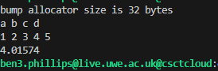
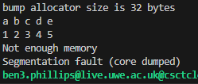
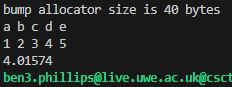
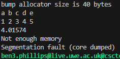
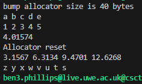

# ASP_worksheet2

## Task 1

For this task I implemented a bump allocation class. You can find this class in the 'bump_allocator.hpp' file. The class has four variables; memory which is a pointer to the start of the block of memory that is defined, allocator_size which defines the size of memory that can be used, offset which is the point that shows how far the allocated memory has reached, and count which is the number of current memory allocations.
```c++
char *memory;
size_t allocator_size;
size_t offset;
int count;
```

<br/>

The class also has a constructor that requires a parameter and two template functions; alloc and dealloc.

The constructor will create a new block of memory of size s and set the offset and count to 0.
```c++
bump_allocator(size_t s)
{
    allocator_size = s;
    memory = new char[allocator_size];
    offset = 0;
    count = 0;
}
```

<br/>

The alloc function will take a number of arguments of any given type and attempt to allocate the memory for them and return a pointer to the memory. It will first find the total size needed for the allocation by multiplying the number of arguments by the size of the type.
```c++
size_t size = args * sizeof(T);
```

Then it will work out if any alignment is needed and will pad accordingly. This will happen for example if you first allocated a char, which is 1 byte, and then allocated an int, which is 4 bytes. Instead of just adding them for a total of 5 bytes, the space after the char will first be padded by 3 bytes and the int will be placed after that, totaling 8 bytes. This is to optimise the speed of accessing the memory so seperate memory blocks do not have to be accessed for one fetch.
```c++
// check alignment
size_t align = 0;
if (!(offset % alignof(T) == 0)) {
    align = (alignof(T) - (offset % alignof(T)));
}
```

After that it will check if there is enough space left in the allocator to allocate the memory that is needed using the offset, the padding amount and the total size of the requested allocation. If there is not enough space available then a null pointer will be returned.
```c++
// if there is not enough space left then return nullptr
if ((offset + align + size) > allocator_size) {
    cout << "Not enough memory" << endl;
    return nullptr;
}
```

If there is enough memory that means the allocation can proceed and a new pointer will be created for the type at the next space in the allocators memory. The count will be incremented and the offset will be increased accordingly. Finally the pointer to the allocated memory will be returned.
```c++
// make new pointer at the next space and return
T *mem = (T*)(memory + offset + align);
offset += align + size; // move offset up
count++;
return mem;
```

<br/>

The dealloc function will take a pointer of any type and decrement the count variable. If the count reaches 0 then there should be no more allocations being used so the offset can be reset and the allocator can be used from the start of the memory block again. I have also added an assert function to ensure the count cannot go below 0 as this would cause unexpected behaviour and issues.
```c++
template <class T>
void dealloc(T *ptr)
{
    assert(count > 0);

    count--;
    
    // if all allocations have been deallocated then reset the heap to the start
    if (count == 0) {
        offset = 0;
        cout << "Allocator reset" << endl;
    }
}
```

<br/>

I have wrote some code to test this class. You can find this in the 'test_bump.cpp' file.

Here I initialise the bump allocator with 32 bytes of memory. Then I call my alloc function using some different types; char, int and double and assigning values to them. The total amount of bytes I allocate add up to 32 which is the size of memory for the allocator.
```c++
int bump_allocator_size = 32;
bump_allocator bump(bump_allocator_size);
cout << "bump allocator size is " << bump_allocator_size << " bytes" << endl;

// allocate memory using bump allocator
int cCount = 4;
char *pChar = bump.alloc<char>(cCount);
for (int i = 0; i < cCount; i++) {
    *(pChar + i) = 'a' + i;
    cout << *(pChar + i) << " ";
}
cout << endl;

int iCount = 5;
int *pInt = bump.alloc<int>(iCount);
for (int i = 0; i < iCount; i++) {
    *(pInt + i) = i + 1;
    cout << *(pInt + i) << " ";
}
cout << endl;

double *pDouble = bump.alloc<double>(1);
*pDouble = 4.01574;
cout << *pDouble << endl;
```

Here you can see the output of it running.




If I change the cCount variable from 4 to 5 then that will increase the amount of chars allocated by one and when the double is allocated it should return a null pointer as there will not be enough memory available.
```c++
int cCount = 5;
```



To allow enough memory for the program to succeed the allocator memory size must be at least 40 bytes. This is because adding the extra char would add a byte, then when the integers are allocated it will be padded by 3 bytes bringing it up to 28. Then when the double is allocated it will be padded by 4 bytes bringing the total to 40. You can see the output with 40 bytes is successful.



<br/>

I have extended the code in the 'test_bump.cpp' file to test the dealloc function and that the allocator resets when all allocations have been deallocated.

The allocator should only allow for allocations on the end of the memory and only move upwards. So deallocating the char pointer and creating another should not work. First I added the code below onto the existing program and tested this.
```c++
// deallocate memory using bump allocator
bump.dealloc(pChar);
char *c = bump.alloc<char>(1);
*c = 'a';
cout << *c << endl;
```

The output was as expected and didn't allow the allocation due to not enough memory.




Then I checked that the memory would reset if all allocations were deallocated. 

I deallocated the original three pointers and used my alloc function to create others.
```c++
// deallocate memory
bump.dealloc(pChar);

bump.dealloc(pInt);

bump.dealloc(pDouble);


// allocate memory
int dCount = 4;
double *d = bump.alloc<double>(dCount);
for (int i = 0; i < dCount; i++) {
    *(d + i) = 3.1567 * (i + 1);
    cout << *(d + i) << " ";
}
cout << endl;

cCount = 8;
char *c = bump.alloc<char>(cCount);
for (int i = 0; i < cCount; i++) {
    *(c + i) = 'z' - i;
    cout << *(c + i) << " ";
}
cout << endl;
```

The allocator successfully reset and allowed new allocations.




## Task 2


## Task 3